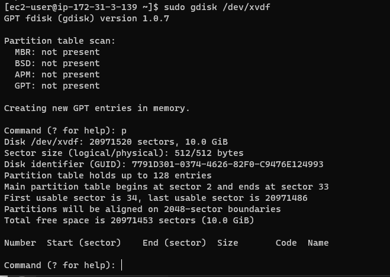
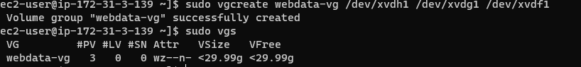
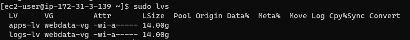
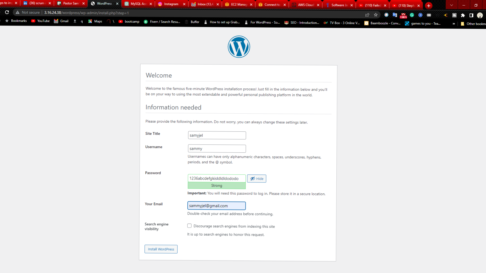
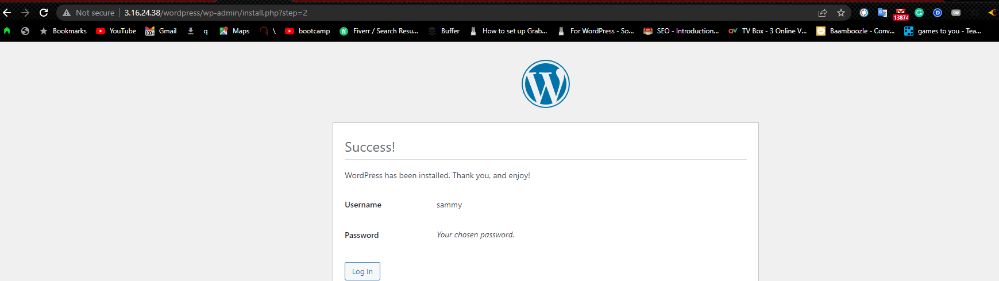

# WEB SOLUTION WITH WORDPRESS 

You must launch two AWS instances for this project, one for the web server and the other for the database server.

Start an EC2 instance designated as the "Web Server." Create three 10 GiB volumes in the same available zone as your web server EC2 using terraform .

NB: Make sure the zone you select matches the instance you generated.

Attach each of the three volumes to your Web Server EC2 instance one at a time.

For a list of the block devices connected to the server, use the `lsblk`command on the terminal and make sure you see `xvdf` `xvdg` `xvdh` as shown below:

With the `df` -h command, you may check all of your server's mounts and free space.

For each of the three server disks that are available, make a single partition. `gdisk /dev/xvdf`

 

It should be noted that the same procedure applies to disks XVDG and XVDH.

4 set up logical volume

Install the Logical Volume Management package to check the server's available partitions.

`yum install lvm2 -y`

`lvmdiskscan`

Create PVs so that LVM can utilise your drives as physical volumes.

`pvcreate /dev/xvdf1`

`pvcreate /dev/xvdg1`

`pvcreate /dev/xvdh1`

With the command pvs, you can check to see if the PVs you created were created successfully.

To the same volume group, add the three newly created physical volumes (VG). Label the VG with "webdata-vg"

the command `vgcreate webdata-vg /dev/xvdh1 /dev/xvdg1 /dev/xvdf1`

then use the command vgs to verify whether the VG was created successfully.

Apps-lv and logs-lv are two logical volumes that should be created. Apps-lv will take half of the available pv space, and Logs-lv will use the other half. Whereas the logs-lv will be utilized to store data for logs, the apps-lv will house website data.

Run the following command to create the apps-lv and logs-lv:

`lvcreate -n apps-lv -L 14G webdata-vg`

`lvcreate -n logs-lv -L 14G webdata-vg`

To ensure that the two LVs have been established successfully, run the lvs command.

If you want to check the full configuration, run this command.

`vgdisplay -v #view complete setup - VG, PV, and LV`

you can as well run lsblk command to check the new status of the blocks;

Format the logical volume with ext4 filesystem

`mkfs -t ext4 /dev/webdata-vg/apps-lv`

`mkfs -t ext4 /dev/webdata-vg/logs-lv`

create /var/www/html directory in which the wordpress data will be stored.

`mkdir -p /var/www/html`

Also, create /home/var/logs directory to store log data backup.

`mkdir -p /home/recovery/logs`

Mount /var/wwww/html on apps-lv logical volume

`mount /dev/webdata/-vg/apps-lv /var/www/html/`

Backup all the files in the log directory /var/log into /home/recovery/logs becuase mounting the filesystem will delete all existing data in the directory.

`rsync -av /var/log/. /home/recovery/logs/`

Afte the data in the /var/log directory have been backed up, mount /var/log on logs-lv logical volume

`mount /dev/webdata-vg/logs-lv /var/log`

Restore files in the /var/log directory back with

`rsync -av /home/recovery/logs/. /var/log`

Configure /etc/fstab file with your own Universal User Identity (UUID). To get your own UUID run command blkid

Copy the UUID from the blkid command that is highlighted in the figure above, and then open the /etc/fstab file in your preferred text editor.

`vi /etc/fstab` and the paste in the UUID as shown in the example below

Check the settings and restart the daemon

mount -a

systemctl daemon-reload

You can use the command df -h to check your setup if you'd like.

If you wish, you can verify you setup with command df -h

## STEP 3 INSTALL WORDPRESS ON WEB SERVER EC2

Update the server

y`um update -y`

Install wget, Apache and it's dependencies

`yum -y install wget httpd php php-mysqlnd php-fpm php-json`

Start Apache

`systemctl enable httpd systemctl start httpd`

Install PhP and its dependencies yum install https://dl.fedoraproject.org/pub/epel/epel-release-latest-8.noarch.rpm

`yum install yum-utils http://rpms.remirepo.net/enterprise/remi-release-8.rpm`

`yum module list php`

`yum module reset php`

`yum module enable php:remi-7.4`

`yum install php php-opcache php-gd php-curl php-mysqlnd`

`systemctl start php-fpm`

`systemctl enable php-fpm`

`setsebool -P httpd_execmem 1`

Restart Apache

`systemctl restart httpd`

Download wordpress to /var/www/html

create a new directory called wordpress and open it.

`mkdir wordpress`

`cd wordpress`

then download wordpress data from wordpress website with command

`wget http://wordpress.org/latest.tar.gz`

`tar xzvf latest.tar.gz`

`rm -rf latest.tar.gz`

Copy the wordpress configuration and pass it to /var/www/html

`cp wordpress/wp-config-sample.php wordpress/wp-config.php`

`cp -R wordpress /var/www/html/`

configure apache to make use of wordpress data in the /var/www/html

`chown -R apache:apache /var/www/html/wordpress`

`chcon -t httpd_sys_rw_content_t /var/www/html/wordpress -R`

`setsebool -P httpd_can_network_connect=1`

## STEP 4 CONFIGURE DATABASE SERVER FOR WORDPRESS

update the server and install mysql

`yum -y update`

`yum install mysql-server`

start mysql and check the status to know if it is up and running

`systemctl start mysqld`

`systemctl status mysqld`

Login to mysql console

`mysql`

create wordpress as a database user

`CREATE DATABASE wordpress;`

`CREATE USER @ IDENTIFIED BY 'mypass';`

`GRANT ALL ON wordpress.* TO 'myuser'@'<Web-Server-Private-IP-Address>';`

`FLUSH PRIVILEGES;`

`SHOW DATABASES;`

`exit`

## STEP 6 CONFIGURE WORDPRESS TO CONNECT REMOTELY TO DATABASE

You need to first open your DB EC2 security group and open port 3306 and allow access to the server only from the web server private ip address.

On your web server, install mysql

`yum install mysql`

open the mysql console on the web server and verify if you can execute SHOW DATABASES; command to see existing databases

`mysql -u <name of user> -p -h <DB-Server-Private-IP-Address>`

Finally, enable TCP port 80 in your Web Server EC2's setup for inbound rules.

Try to get the link to your wordpress from your web browser.

http://<web-server-public-ip-Address>/wordpress

If your configuration is correct then you should see the following output

 
 Congratulations!!! :) 