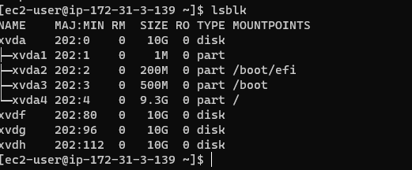

# WEB SOLUTION WITH WORDPRESS 

Start an EC2 instance designated as the "Web Server." Create three 10 GiB volumes in the same available zone as your web server EC2.

NB: Make sure the zone you select matches the instance you generated.

Attach each of the three volumes to your Web Server EC2 instance one at a time.

For a list of the block devices connected to the server, use the `lsblk`command on the terminal and make sure you see `xvdf` `xvdg` `xvdh` as shown below:

With the df -h command, you may check all of your server's mounts and free space.

